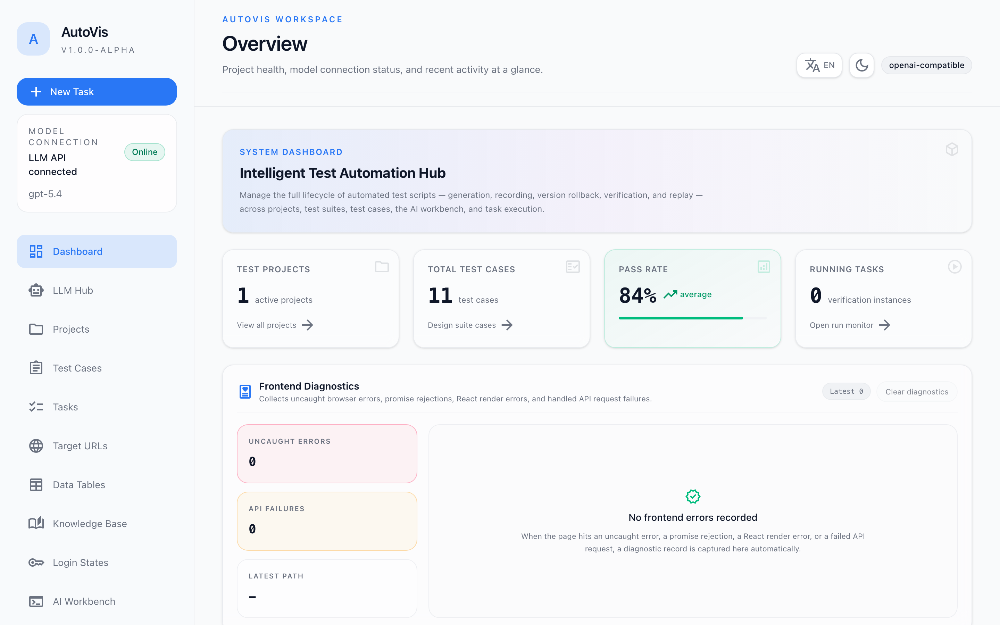
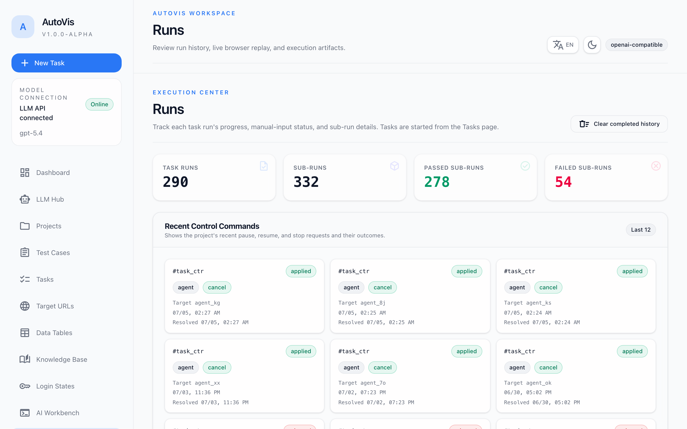
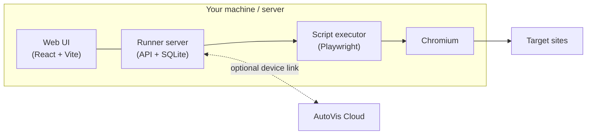

<div align="center">


# AutoVis Runner

**AI-driven browser automation on your own machine — local web UI, one-line install, your data stays local.**

[](https://github.com/Yuikij/autovis-runner/releases/latest)
[](LICENSE)
[](https://hub.docker.com/r/yuimax/autovis-runner)


English | [简体中文](README.zh-CN.md)



</div>

## What is AutoVis Runner?

AutoVis Runner is the local execution node for AutoVis. It runs browser automation
tasks (powered by [Playwright](https://playwright.dev)) on your own machine or
server, keeps login state and data local, and exposes a web UI and API to manage
everything.

- **AI script generation** — describe a test case, and an LLM agent explores the
  real page step by step, then produces a replayable automation script. Works
  with any OpenAI-compatible API.
- **Local web UI** — projects, test cases, tasks, live runs, and artifacts, all
  managed from the browser. Bilingual interface (English / 简体中文), switchable
  from the top bar.
- **Login state management** — capture cookies + localStorage from a real
  browser session and re-inject them into automation runs, so scripts skip the
  login wall.
- **Tasks & scheduling** — organize cases into tasks, trigger them on a
  schedule, and track every run with full history.
- **Data tables & knowledge base** — parameterize runs with tabular data and
  feed domain knowledge to the agent.
- **Runs & artifacts** — screenshots, HTML reports, and live browser streaming
  while a run is in progress.
- **Standalone or connected** — runs fully standalone; optionally register to an
  AutoVis Cloud endpoint with a device token.
- **Self-host friendly** — optional authentication, multiple users, and at-rest
  encryption for stored secrets.

## Quick start

| Method | Platforms | Service / autostart |
| --- | --- | --- |
| Install script | macOS, Linux, Windows | launchd / systemd / Windows Service |
| Docker | any Docker host | `--restart unless-stopped` |
| From source | any | optional, via the install scripts |

The install scripts download the latest release, install dependencies and
browsers, register a system service that starts on boot/login and restarts on
crash, and start the runner. If Node.js 25+ is not already on the machine, a
bundled Node runtime is downloaded automatically into the install directory.
The web UI is served at `http://localhost:8787` once the runner is up.

### macOS

```shell
curl -fsSL https://raw.githubusercontent.com/Yuikij/autovis-runner/main/install.sh | bash
```

Installs to `~/.autovis-runner`, config in `~/.autovis/runner.env`, and
registers a launchd agent (`com.autovis.runner`) that starts at login and
restarts on crash.

### Linux

```shell
curl -fsSL https://raw.githubusercontent.com/Yuikij/autovis-runner/main/install.sh | sudo bash
```

Installs to `/opt/autovis-runner`, config in `/etc/autovis/runner.env`, and
registers a systemd service (`autovis-runner`) that starts on boot.

### Windows (PowerShell, run as Administrator)

```powershell
irm https://raw.githubusercontent.com/Yuikij/autovis-runner/main/install.ps1 -OutFile install.ps1
powershell -ExecutionPolicy Bypass -File install.ps1
```

Installs to `C:\autovis-runner` and registers a native Windows Service
(`AutoVisRunner`) via [WinSW](https://github.com/winsw/winsw) that starts on
boot, restarts on crash, and rotates logs.

### Docker

With Docker Compose (see `docker-compose.yml` in this repo):

```shell
docker compose up -d
```

Or with plain `docker run`:

```shell
docker run -d \
  --name autovis-runner \
  --restart unless-stopped \
  --shm-size=2g \
  -p 8787:8787 \
  -v autovis-data:/var/lib/autovis \
  -e AUTOVIS_CONFIG_DIR=/var/lib/autovis/config \
  -e AUTOVIS_CLOUD_URL=https://your-autovis-cloud.example.com \
  -e AUTOVIS_DEVICE_TOKEN=<device-token> \
  yuimax/autovis-runner:latest
```

For Docker, passing `AUTOVIS_CLOUD_URL` and `AUTOVIS_DEVICE_TOKEN` as
environment variables is the recommended registration flow. If you prefer the
CLI helper, call it by absolute path inside the container:

```shell
docker exec -it autovis-runner /opt/autovis-runner/bin/autovis-runner register \
  --token <device-token> \
  --cloud-url https://your-autovis-cloud.example.com
docker restart autovis-runner
```

### Install script options

```shell
# Pin a specific release:
curl -fsSL .../install.sh | sudo bash -s -- --version 0.9.1

# Build and install from a source checkout:
./install.sh --from-source

# Install files only, no service registration:
curl -fsSL .../install.sh | sudo bash -s -- --no-service
```

```powershell
# Windows equivalents:
powershell -ExecutionPolicy Bypass -File install.ps1 -Version 0.9.1
powershell -ExecutionPolicy Bypass -File install.ps1 -FromSource
powershell -ExecutionPolicy Bypass -File install.ps1 -InstallDir D:\my-autovis
powershell -ExecutionPolicy Bypass -File install.ps1 -SkipService
```

## A look inside

Execution center with run history, live progress, and artifacts:

<div align="center">
  
</div>

## Architecture



Everything — scripts, run history, login state, LLM configuration — is stored
locally in SQLite. The cloud link is optional and off by default.

## Service management

The installer links the `autovis-runner` command into your PATH
(`/opt/homebrew/bin`, `/usr/local/bin`, or `~/.local/bin`). It manages the
service on macOS and Linux:

```shell
autovis-runner status     # service status
autovis-runner restart    # restart the service
autovis-runner stop       # stop the service
autovis-runner logs       # follow logs
autovis-runner enable     # enable autostart on boot/login
autovis-runner disable    # disable the service
autovis-runner start      # run in the foreground (no service)
```

The native tools also work directly:

```shell
# Linux (systemd)
sudo systemctl status autovis-runner
sudo journalctl -u autovis-runner -f

# macOS (launchd)
launchctl print gui/$(id -u)/com.autovis.runner
tail -f ~/.autovis-runner/logs/runner.log
```

```powershell
# Windows (WinSW service)
Get-Service AutoVisRunner
C:\autovis-runner\winsw\autovis-service.exe status
Get-Content C:\autovis-runner\logs\autovis-service.out.log -Wait
```

## Upgrade

Re-run the install script. Config (`runner.env`) and data are preserved; the
application files are replaced and the service is restarted:

```shell
# macOS
curl -fsSL https://raw.githubusercontent.com/Yuikij/autovis-runner/main/install.sh | bash

# Linux
curl -fsSL https://raw.githubusercontent.com/Yuikij/autovis-runner/main/install.sh | sudo bash
```

```powershell
# Windows
powershell -ExecutionPolicy Bypass -File install.ps1
```

## Uninstall

```shell
# macOS / Linux: remove service + files, keep config and data
curl -fsSL https://raw.githubusercontent.com/Yuikij/autovis-runner/main/install.sh | sudo bash -s -- --uninstall

# Also remove config and data
curl -fsSL https://raw.githubusercontent.com/Yuikij/autovis-runner/main/install.sh | sudo bash -s -- --uninstall --purge
```

On macOS, run without `sudo`.

```powershell
# Windows: remove service + application files, keep config and data
powershell -ExecutionPolicy Bypass -File install.ps1 -Uninstall

# Also remove config and data
powershell -ExecutionPolicy Bypass -File install.ps1 -Uninstall -Purge
```

## Authentication & security

Authentication is disabled by default. To protect a self-hosted runner, set:

```shell
AUTOVIS_AUTH_ENABLED=true
AUTOVIS_ADMIN_USER=admin
AUTOVIS_ADMIN_PASSWORD=<strong-password>
```

In production, the runner refuses to start without authentication when
`APP_ORIGIN` is not localhost unless you explicitly set:

```shell
AUTOVIS_ALLOW_INSECURE_NO_AUTH=true
```

LLM account storage can be shared by every login or separated per user:

```shell
AUTOVIS_LLM_SCOPE=shared    # default
AUTOVIS_LLM_SCOPE=per_user  # each login has its own LLM configs and secrets
```

To encrypt stored API keys, Git credentials, and browser login state at rest,
set a stable server-side key before first write:

```shell
AUTOVIS_SECRET_KEY=<strong-random-secret>
```

Keep the same key across restarts. Existing plaintext rows stay readable, but
encrypted rows require the same key to decrypt. This key is optional: without
it the runner still starts and new sensitive values are stored in plaintext for
backward compatibility. If encrypted rows exist but the key is missing or
wrong, those values are treated as temporarily unavailable until the correct
key is restored.

Multiple users can be seeded with:

```shell
AUTOVIS_USERS=alice:password:admin,bob:password:user
```

## Development

Requires Node.js 25+ and pnpm 10:

```shell
pnpm install
pnpm dev        # web UI + server in watch mode
pnpm build      # build all workspaces
pnpm start      # run the built server
```

## Release

This repository contains the public AutoVis Runner source. Release artifacts
are packaged as `autovis-runner-<version>.tar.gz`.

## License

[MIT](LICENSE)
