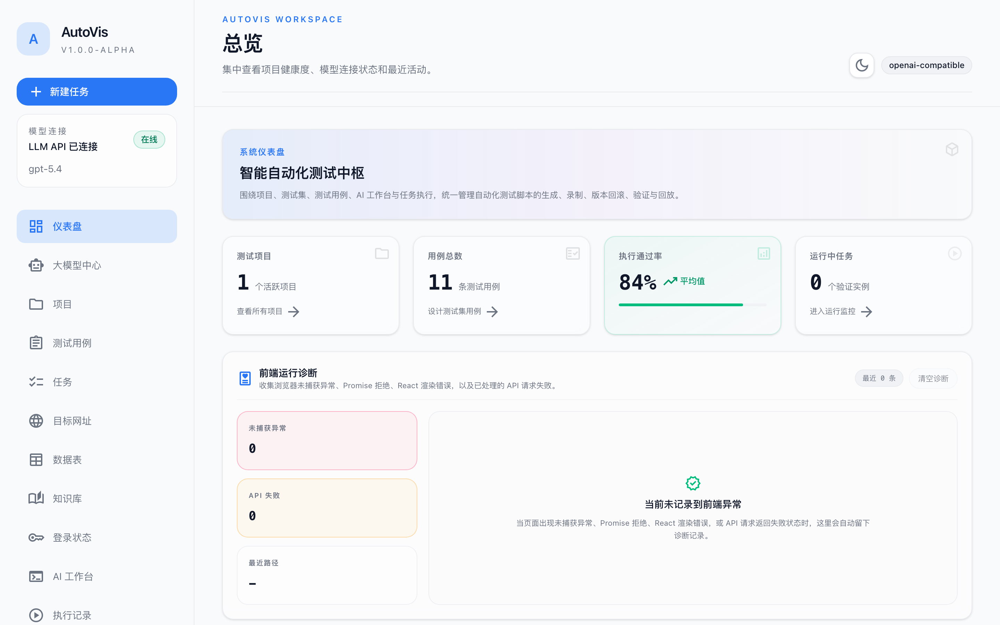
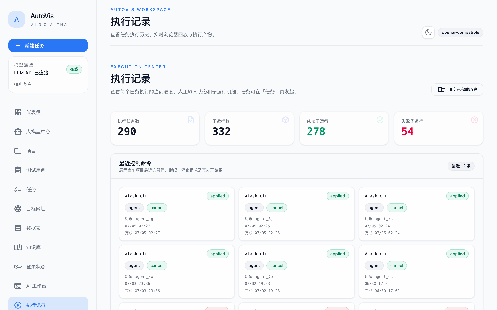
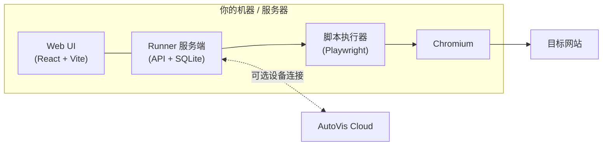

<div align="center">


# AutoVis Runner

**在你自己的机器上运行 AI 驱动的浏览器自动化——本地 Web UI、一行命令安装、数据完全留在本地。**

[](https://github.com/Yuikij/autovis-runner/releases/latest)
[](LICENSE)
[](https://hub.docker.com/r/yuimax/autovis-runner)


[English](README.md) | 简体中文



</div>

## AutoVis Runner 是什么？

AutoVis Runner 是 AutoVis 的本地执行节点。它在你自己的机器或服务器上运行基于
[Playwright](https://playwright.dev) 的浏览器自动化任务，登录态和数据全部保存在
本地，并提供一套 Web UI 和 API 来管理一切。

- **AI 生成脚本** —— 描述一条测试用例，LLM Agent 会在真实页面上逐步探索，
  最终产出可回放的自动化脚本。兼容任何 OpenAI 风格的 API。
- **本地 Web UI** —— 项目、测试用例、任务、实时运行、产物，全部在浏览器里管理。
- **登录态管理** —— 从真实浏览器会话采集 cookies + localStorage 并注入到自动化
  运行中，让脚本直接跳过登录墙。
- **任务与调度** —— 把用例组织成任务、按计划触发，每次运行都有完整历史记录。
- **数据表与知识库** —— 用表格数据参数化运行，为 Agent 注入领域知识。
- **运行与产物** —— 截图、HTML 报告，运行过程中还能实时观看浏览器画面。
- **独立或联网** —— 可完全独立运行；也可以用设备令牌注册到 AutoVis Cloud。
- **适合自托管** —— 可选的登录认证、多用户，以及敏感数据的静态加密。

## 快速开始

| 方式 | 平台 | 服务 / 开机自启 |
| --- | --- | --- |
| 安装脚本 | macOS、Linux、Windows | launchd / systemd / Windows 服务 |
| Docker | 任何 Docker 主机 | `--restart unless-stopped` |
| 源码安装 | 任意 | 可选，通过安装脚本 |

安装脚本会下载最新 release、安装依赖和浏览器、注册开机自启且崩溃自动重启的系统
服务，并启动 runner。如果机器上没有 Node.js 25+，会自动下载一份内置的 Node 运行时
到安装目录。启动后访问 `http://localhost:8787` 即可打开 Web UI。

### macOS

```shell
curl -fsSL https://raw.githubusercontent.com/Yuikij/autovis-runner/main/install.sh | bash
```

安装到 `~/.autovis-runner`，配置在 `~/.autovis/runner.env`，注册 launchd 代理
（`com.autovis.runner`），登录时启动、崩溃后自动重启。

### Linux

```shell
curl -fsSL https://raw.githubusercontent.com/Yuikij/autovis-runner/main/install.sh | sudo bash
```

安装到 `/opt/autovis-runner`，配置在 `/etc/autovis/runner.env`，注册 systemd 服务
（`autovis-runner`），开机自启。

### Windows（PowerShell，以管理员身份运行）

```powershell
irm https://raw.githubusercontent.com/Yuikij/autovis-runner/main/install.ps1 -OutFile install.ps1
powershell -ExecutionPolicy Bypass -File install.ps1
```

安装到 `C:\autovis-runner`，通过 [WinSW](https://github.com/winsw/winsw) 注册原生
Windows 服务（`AutoVisRunner`），开机自启、崩溃重启、自动轮转日志。

### Docker

使用 Docker Compose（见仓库中的 `docker-compose.yml`）：

```shell
docker compose up -d
```

或直接 `docker run`：

```shell
docker run -d \
  --name autovis-runner \
  --restart unless-stopped \
  --shm-size=2g \
  -p 8787:8787 \
  -v autovis-data:/var/lib/autovis \
  -e AUTOVIS_CONFIG_DIR=/var/lib/autovis/config \
  -e AUTOVIS_CLOUD_URL=https://your-autovis-cloud.example.com \
  -e AUTOVIS_DEVICE_TOKEN=<device-token> \
  yuimax/autovis-runner:latest
```

Docker 部署推荐直接用 `AUTOVIS_CLOUD_URL` 和 `AUTOVIS_DEVICE_TOKEN` 环境变量完成
注册。也可以在容器内用绝对路径调用 CLI 助手：

```shell
docker exec -it autovis-runner /opt/autovis-runner/bin/autovis-runner register \
  --token <device-token> \
  --cloud-url https://your-autovis-cloud.example.com
docker restart autovis-runner
```

### 安装脚本选项

```shell
# 固定安装某个版本：
curl -fsSL .../install.sh | sudo bash -s -- --version 0.9.1

# 从源码检出构建安装：
./install.sh --from-source

# 只安装文件，不注册服务：
curl -fsSL .../install.sh | sudo bash -s -- --no-service
```

```powershell
# Windows 对应命令：
powershell -ExecutionPolicy Bypass -File install.ps1 -Version 0.9.1
powershell -ExecutionPolicy Bypass -File install.ps1 -FromSource
powershell -ExecutionPolicy Bypass -File install.ps1 -InstallDir D:\my-autovis
powershell -ExecutionPolicy Bypass -File install.ps1 -SkipService
```

## 界面一览

执行中心：运行历史、实时进度与产物：

<div align="center">
  
</div>

## 架构



脚本、运行历史、登录态、LLM 配置——一切都保存在本地 SQLite 中。云端连接是可选
的，默认关闭。

## 服务管理

安装器会把 `autovis-runner` 命令链接到 PATH（`/opt/homebrew/bin`、
`/usr/local/bin` 或 `~/.local/bin`），在 macOS 和 Linux 上直接管理服务：

```shell
autovis-runner status     # 服务状态
autovis-runner restart    # 重启服务
autovis-runner stop       # 停止服务
autovis-runner logs       # 跟踪日志
autovis-runner enable     # 启用开机自启
autovis-runner disable    # 禁用服务
autovis-runner start      # 前台运行（不走服务）
```

系统原生工具也可以直接使用：

```shell
# Linux (systemd)
sudo systemctl status autovis-runner
sudo journalctl -u autovis-runner -f

# macOS (launchd)
launchctl print gui/$(id -u)/com.autovis.runner
tail -f ~/.autovis-runner/logs/runner.log
```

```powershell
# Windows (WinSW 服务)
Get-Service AutoVisRunner
C:\autovis-runner\winsw\autovis-service.exe status
Get-Content C:\autovis-runner\logs\autovis-service.out.log -Wait
```

## 升级

重新运行安装脚本即可。配置（`runner.env`）和数据会保留，应用文件被替换，服务自动
重启：

```shell
# macOS
curl -fsSL https://raw.githubusercontent.com/Yuikij/autovis-runner/main/install.sh | bash

# Linux
curl -fsSL https://raw.githubusercontent.com/Yuikij/autovis-runner/main/install.sh | sudo bash
```

```powershell
# Windows
powershell -ExecutionPolicy Bypass -File install.ps1
```

## 卸载

```shell
# macOS / Linux：移除服务和文件，保留配置与数据
curl -fsSL https://raw.githubusercontent.com/Yuikij/autovis-runner/main/install.sh | sudo bash -s -- --uninstall

# 连配置和数据一起删除
curl -fsSL https://raw.githubusercontent.com/Yuikij/autovis-runner/main/install.sh | sudo bash -s -- --uninstall --purge
```

macOS 上不需要 `sudo`。

```powershell
# Windows：移除服务和应用文件，保留配置与数据
powershell -ExecutionPolicy Bypass -File install.ps1 -Uninstall

# 连配置和数据一起删除
powershell -ExecutionPolicy Bypass -File install.ps1 -Uninstall -Purge
```

## 认证与安全

认证默认关闭。要保护自托管的 runner，设置：

```shell
AUTOVIS_AUTH_ENABLED=true
AUTOVIS_ADMIN_USER=admin
AUTOVIS_ADMIN_PASSWORD=<strong-password>
```

生产环境中，当 `APP_ORIGIN` 不是 localhost 时，runner 会拒绝在未开启认证的情况下
启动，除非显式设置：

```shell
AUTOVIS_ALLOW_INSECURE_NO_AUTH=true
```

LLM 账号存储可以所有登录共享，也可以按用户隔离：

```shell
AUTOVIS_LLM_SCOPE=shared    # 默认
AUTOVIS_LLM_SCOPE=per_user  # 每个登录拥有自己的 LLM 配置和密钥
```

要对存储的 API Key、Git 凭据和浏览器登录态做静态加密，在首次写入前设置一个稳定
的服务端密钥：

```shell
AUTOVIS_SECRET_KEY=<strong-random-secret>
```

重启后保持同一个密钥。已有的明文数据仍可读取，但加密数据必须用同一密钥解密。
这个密钥是可选的：不配置时 runner 照常启动，新的敏感数据继续以明文存储以保持向后
兼容。如果已存在加密数据但密钥缺失或错误，runner 会继续运行，这些敏感值会被视为
暂不可用，直到恢复正确的密钥。

批量预置多个用户：

```shell
AUTOVIS_USERS=alice:password:admin,bob:password:user
```

## 开发

需要 Node.js 25+ 和 pnpm 10：

```shell
pnpm install
pnpm dev        # web UI + 服务端，监听模式
pnpm build      # 构建所有 workspace
pnpm start      # 运行构建产物中的服务端
```

## 发布

本仓库是 AutoVis Runner 的公开源码。发布产物打包为
`autovis-runner-<version>.tar.gz`。

## 许可证

[MIT](LICENSE)
